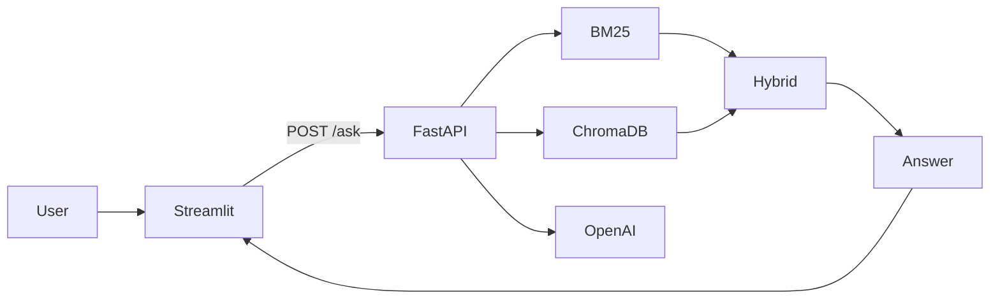

# 🚀 AnthraSync – Interactive Hybrid RAG Assistant

<p align="center">


</p>

> An interactive **Hybrid Retrieval-Augmented Generation (Hybrid RAG)** assistant built with **FastAPI**, **Streamlit**, **ChromaDB**, **BM25**, and **OpenAI**.

---

# 🌐 Live Links

- 🎨 **Frontend (Streamlit Cloud):** https://an-enterprise-knowledge-assistant-kpxlbzqiabwxpovzybejr3.streamlit.app
- ⚙️ **Backend API (Docker + Cloud):** https://eshwar109-assignment-anthra.hf.space

---

# 📖 Overview

AnthraSync combines **BM25 lexical search** and **Dense Vector Retrieval** to deliver accurate, explainable, and source-backed answers from enterprise documents.

## ✨ Features

- 🤖 Hybrid Retrieval (BM25 + Dense Search)
- 📚 PDF Knowledge Base
- ⚡ FastAPI Backend
- 🎨 Streamlit Frontend
- 🔍 Retrieval Diagnostics
- 📄 Source Citation
- ❤️ Health Monitoring
- ☁️ Dockerized Backend Deployment

---

# 🏗 Architecture



---

# 🛠 Tech Stack

| Category | Technology |
|---|---|
| Language | Python 3.10+ |
| Backend | FastAPI, Uvicorn |
| Frontend | Streamlit |
| LLM | OpenAI |
| Embeddings | sentence-transformers |
| Vector DB | ChromaDB |
| Retrieval | BM25 + Dense Search |
| Deployment | Docker + Cloud |

---

# 📂 Project Structure

```text
AnthraSync/
├── backend/
│   ├── api.py
│   ├── rag_engine.py
├── frontend/
│   ├── app_ui.py
│   └── requirements.txt
├── knowledge_base/
├── chromastore/
├── Dockerfile
├── requirements.txt
└── README.md
```

---

# ⚙️ Quick Start

## Clone

```bash
git clone https://github.com/YOUR_USERNAME/AnthraSync.git
cd AnthraSync
```

## Install Dependencies (uv)

```bash
uv sync
```

or

```bash
uv pip install -r requirements.txt
```

## Environment Variables

```env
OPENAI_API_KEY=your_openai_api_key
HF_TOKEN=your_huggingface_token
```

## Run Backend

```bash
uv run uvicorn backend.api:app --reload --host 0.0.0.0 --port 8000
```

## Run Frontend

```bash
uv run streamlit run frontend/app_ui.py
```

---

# ☁️ Deployment

## Frontend

Deploy to **Streamlit Cloud** using:

- Entry point: `frontend/app_ui.py`

## Backend

The backend is packaged using **Docker** and deployed to a cloud server.

### Build

```bash
docker build -t anthrasync-backend .
```

### Run

```bash
docker run -d \
-e OPENAI_API_KEY="<your_key>" \
-e HF_TOKEN="<hf_token>" \
-p 8000:8000 \
-v $(pwd)/chromastore:/app/chromastore \
anthrasync-backend
```

---

# 📡 API

| Method | Endpoint |
|---|---|
| GET | `/health` |
| POST | `/ask` |

Example

```json
{
  "question":"Explain Hybrid RAG"
}
```

---

# 🔐 Environment Variables

| Variable | Purpose |
|---|---|
| OPENAI_API_KEY | OpenAI API |
| HF_TOKEN | HuggingFace Token |
| CHROMA_PERSIST_PATH | Chroma Storage |

---

# 🧪 Testing & Diagnostics

### 🔍 tmp_rag_inspect.py

- Inspect parsed documents
- View chunks
- Debug BM25 & Dense retrieval

### ✅ tmp_rag_test.py

- Validate environment variables
- Test embeddings
- Verify OpenAI connectivity
- End-to-end RAG test

---

# 🚀 Future Improvements

- 💬 Chat Memory
- 🌍 Multi Knowledge Bases
- 📈 Analytics Dashboard
- 🎙 Voice Search
- 📱 Mobile UI
- 🧠 Agentic RAG

---

# 👨‍💻 Author

**T. Eshwar T**

- 💼 LinkedIn: www.linkedin.com/in/eshwarofficial
- 🐙 GitHub: https://github.com/Eshwar-129

---

⭐ If you like this project, consider starring the repository!
